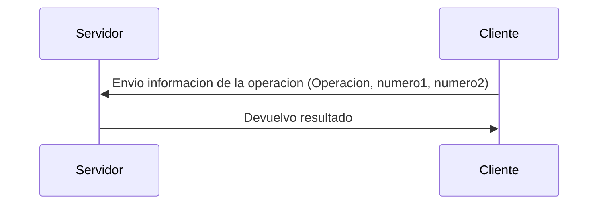

Este protocolo se define dandole al servidor la informacion sobre la operacion a realizar, junto con los numeros a operar

```mermaid
sequenceDiagram
  participant S as Servidor
  participant C as Cliente
  C ->> S: Envio informacion de la operacion (Operacion, numero1, numero2)
  S ->> C: Devuelvo resultado

```